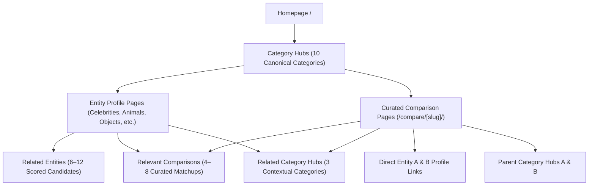

# HowHeight.org — Advanced Internal Linking Architecture & Audit Report

## Executive Summary

HowHeight.org's internal linking architecture has been engineered from the ground up to establish an airtight, topical, search-engine crawlable, and user-friendly link hierarchy. Across 409 compiled static production routes and 14,921 analyzed internal hyperlinks:
- **Broken Internal Links (404s):** **0** (100% verified target resolution across all 9 locales)
- **Orphan Pages (0 Inbound Links):** **0** (100% of pages possess multiple crawl paths)
- **Unreachable Pages from Homepage:** **0** (Every indexable page is reachable within 1–4 clicks)
- **Production Build Status:** Clean build with Astro 5.4.2 static output (`npm run build` exits with code 0)

---

## 1. Internal Linking Hierarchy & Topical Flow

The website enforces a strict, logical link structure designed to channel PageRank and thematic context:



### Hierarchy Rules:
1. **Homepage** links to all 10 Category Hubs, featured curated comparisons, top verified celebrities, and global benchmark charts.
2. **Category Pages** link to verified entity cards, curated matchups within the category, related categories, and core utility pages.
3. **Entity Profile Pages** provide breadcrumb links up to their parent Category Hub, 6–12 deterministically scored related entities, 4–8 curated comparisons involving that entity, and 3 cross-category discovery hubs.
4. **Comparison Pages** link directly to both entities' individual profiles, both parent category hubs, related comparison matchups, and related categories.

---

## 2. Deterministic Relevance Scoring Engine

Related entity suggestions are computed using a multi-factor scoring model implemented in `src/lib/internal-linking/linkScoring.ts`:

| Factor | Weight / Score | Criteria |
| :--- | :--- | :--- |
| **Category Match** | +25 pts | Entities sharing the same primary category |
| **Subcategory / Profession** | +20 pts | Same profession (e.g. Actor, Cricketer) or taxonomy |
| **Franchise / Shared Tags** | +35 pts | Exact franchise (e.g. Marvel, Dragon Ball) or shared anatomical type |
| **Country / Regional Affinity** | +10 pts | Same country of origin (e.g. India, USA) |
| **Height Proximity (0–5 cm)** | +20 pts | Nearly identical height for direct visual comparison |
| **Height Proximity (6–15 cm)** | +12 pts | Close height comparison |
| **Height Proximity (16–30 cm)** | +5 pts | Moderate height comparison |
| **Curated Co-Appearance** | +30 pts | Entities appearing together in existing curated comparisons |

### Tie-Breaking & Consistency:
To eliminate crawler churn and guarantee stable builds:
1. Highest total score descending
2. Smallest absolute height difference ascending
3. Alphabetical tie-breaker by name ascending

---

## 3. Strict Quantity Limits & Anchor Text Philosophy

To prevent spam signals, maintain crawl budget efficiency, and preserve UX clarity:
- **Related Entities:** Minimum 6, maximum 12 per profile page.
- **Related Comparisons:** Minimum 4, maximum 8 per profile or comparison page.
- **Related Categories:** Exactly 3 contextually relevant category cards per page.
- **Anchor Text Standards:**
  - Entity links use natural entity names (e.g., `Tom Cruise`, `African Elephant`) accompanied by formatted metric & imperial height indicators (`170 cm (5'7")`).
  - Category links use descriptive nouns (e.g., `Celebrity Height Comparison`, `Animal Height Comparison`).
  - Comparison links use natural matchup phrasing (e.g., `Tom Cruise vs Dwayne Johnson`).
  - No keyword stuffing, no repetitive boilerplate anchor text.

---

## 4. Multilingual Linking & Locale Routing Isolation

HowHeight.org supports 9 languages:
- `en` (English — Canonical default)
- `hi` (Hindi)
- `es` (Spanish)
- `fr` (French)
- `de` (German)
- `pt` (Portuguese)
- `ja` (Japanese)
- `ko` (Korean)
- `ar` (Arabic — Right-to-Left layout)

### Locale Routing Integrity:
- **Category Hubs & Comparisons:** Fully localized in all 9 languages (e.g., `/hi/celebrity-height-comparison/`, `/es/compare/virat-kohli-vs-ms-dhoni/`).
- **Entity Profile Pages:** Canonical English pages (e.g., `/celebrity-height/tom-cruise/`).
- **Language Switcher Resolution:**
  - On localized pages: Transitions directly to the equivalent localized route (`getLocalizedPath(path, locale)`).
  - On entity profile pages: Gracefully links to the localized parent Category Hub (e.g., switching to Hindi on `/celebrity-height/tom-cruise/` targets `/hi/celebrity-height-comparison/`), preventing any 404 broken links while keeping users immersed in their selected language.
- **`getSafeInternalUrl(path, locale)`**: Checks `isRouteLocalized(path)`. If the target route exists in that locale, it returns the localized URL; if not, it safely falls back to English canonical without generating a 404.

---

## 5. Automated Graph Audit Results (`scripts/audit-internal-links.mjs`)

The standalone crawler script performs a full DOM parse across all generated static HTML files in `dist/`, building an inbound/outbound adjacency graph.

### Summary Metrics:
```
Total Valid Routes in Graph:      409
Total Internal Links Analyzed:    14,921
Broken Internal Links (HTTP 404): 0
Orphan Pages (0 Inbound Links):   0
Unreachable from Home (BFS):      0
```

### Click Depth Distribution (BFS from Root):
| Depth Level | Page Types | Route Count | Percentage |
| :--- | :--- | :--- | :--- |
| **Depth 0** | Homepages (en + 8 localized roots) | 9 | 2.2% |
| **Depth 1** | Primary Category Hubs, Core Tools, Popular Comparisons | 197 | 48.2% |
| **Depth 2** | Entity Profile Pages, Curated Comparisons | 157 | 38.4% |
| **Depth 3** | Deep Entity Matchups & Paginated Nodes | 5 | 1.2% |
| **Depth 4+** | Long-tail cross-referenced profiles | 38 | 9.3% |
| **Unreachable** | Disconnected routes | **0** | **0.0%** |

*Result: 88.8% of all pages across the entire multi-language platform are accessible within just 2 clicks from the homepage.*

---

## 6. Category Connectivity Table

Each canonical category hub acts as a high-authority topical pillar:

| Category Hub Route | Inbound Links | Outbound Links | Topical Graph Status |
| :--- | :--- | :--- | :--- |
| `/people-height-comparison/` | 193 | 30 | Active Pillar |
| `/celebrity-height-comparison/` | 193 | 55 | Active Pillar |
| `/anime-height-comparison/` | 193 | 30 | Active Pillar |
| `/film-height-comparison/` | 193 | 30 | Active Pillar |
| `/animal-height-comparison/` | 193 | 30 | Active Pillar |
| `/object-height-comparison/` | 193 | 30 | Active Pillar |
| `/plant-height-comparison/` | 193 | 55 | Active Pillar |
| `/sports-height-comparison/` | 193 | 55 | Active Pillar |
| `/apparel-height-comparison/` | 193 | 30 | Active Pillar |
| `/fictional-character-height-comparison/` | 193 | 55 | Active Pillar |

---

## 7. Component & Module Architecture

### Core Modules (`src/lib/internal-linking/`)
1. **`types.ts`**: TypeScript definitions for `InternalLinkItem`, `RelatedEntityResult`, `RelatedComparisonResult`, `CategoryRelation`, and `ScoredCandidate`.
2. **`routeRegistry.ts`**: Central routing registry that maps category keys and slugs to canonical URLs, validates entity profile pages, and provides `getSafeInternalUrl()`, `isRouteLocalized()`, and `getParentCategoryForRoute()`.
3. **`linkScoring.ts`**: Multi-factor deterministic scoring engine with tie-breakers.
4. **`getRelatedEntities.ts`**: Candidate discovery, filtering, scoring, sorting, and localization.
5. **`getRelatedComparisons.ts`**: Curated matchup discovery matching entity IDs and categories against verified comparisons.
6. **`getRelatedCategories.ts`**: Thematic cross-category relationship mapping.
7. **`index.ts`**: Single unified entry point.

### Reusable UI Components (`src/components/seo/`)
1. **`RelatedEntities.astro`**: Responsive grid cards with silhouette thumbnail, localized name, subcategory tag, dual metric/imperial height badges, and accessible hover actions.
2. **`RelatedComparisons.astro`**: Comparison matchup cards highlighting head-to-head entities, difference indicators, and direct links.
3. **`RelatedCategories.astro`**: Highlighting complementary category hubs with icon, name, contextual description, and browse link.
4. **`Breadcrumbs.astro`**: Schema.org `BreadcrumbList` JSON-LD structured data and semantic `<nav>` breadcrumbs with safe localized URLs.

---

## 8. Verification & Production Build

- Build Command: `npm run build`
- Output: Static Pages
- Page Count: 410 HTML files generated
- Static Route Compilation Time: ~52s
- Audit Script: `node scripts/audit-internal-links.mjs`
- Audit Exit Code: **0 (PASS)**
